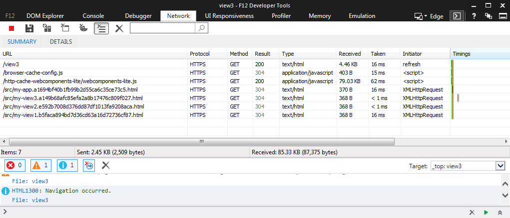

#Goal 
- Configure the polymer app in this repo to use service worker if its available or browser cache otherwise. 
- If any component of the app changes entrypoint/shell/fragments, the component should get updated automatically 
once the app is deployed and the component is accessed. This should happen without clearing the browser 
cache manually.

#Deployed app 
The demo app is [here](https://polymer-app-8f787.firebaseapp.com). Firebase was used for deployment. 
The firebase.json has been configured to support browser caching and service worker caching. 

#Details

- Supporting browser cache with request params was done in this repo [request params browser cache support](https://github.com/eeid26/polymer-app)
- This repo uses the file fingerprint in the url to support the browser cache.
- The build generates two copies of each entry-point/shell/fragment. One with the file fingerprint and one without.
- Not having two copies creates more work of how to deal with a link like
```html
    <link rel="import" href="/src/my-app.html">
```
or when my-view1.html gets requested when service worker is available.

- The files without fingerprint are used by service worker if its available. 
- If service worker is not available, browser-cache-config.js gets loaded.
```javascript
'use strict';
var BrowserCacheConfig = [
  ["/index.aa9246c879855e05553d91c0f964475c.html","aa9246c879855e05553d91c0f964475c"],
  ["/src/my-app.a1694bf40b1fb99b2d55ca6c35ce73c5.html","a1694bf40b1fb99b2d55ca6c35ce73c5"],
  ["/src/my-view1.b5faca894bd7d36cd63a16d72736cf87.html","b5faca894bd7d36cd63a16d72736cf87"],
  ["/src/my-view2.e592b7008d376dd87df1013fa9208aca.html","e592b7008d376dd87df1013fa9208aca"],
  ["/src/my-view3.a149b68afc85efa2a8b17476c809f027.html","a149b68afc85efa2a8b17476c809f027"],
  ["/src/my-view404.b9a28746f736435f74b42f65b65b4eac.html","b9a28746f736435f74b42f65b65b4eac"]];
```
 
- The modified webcomponents-lite.js maps the requested url to a url that contains the file version with the fingerprint.

```javascript

    _getBrowserCacheURL: function (url) {
      var browserCacheConfig = window.BrowserCacheConfig;
      if (browserCacheConfig) {
        for (var i = 0, l = browserCacheConfig.length; i < l; i++) {
          var cacheUrlWithHash = browserCacheConfig[i][0], hash = browserCacheConfig[i][1];
          var index = cacheUrlWithHash.indexOf(hash);
          if (index !== -1) {
            var cacheUrlNoHash = cacheUrlWithHash.substring(0, index) +
              cacheUrlWithHash.substring(index + hash.length + 1, cacheUrlWithHash.length);
            var absoluteUrl = new URL(cacheUrlNoHash, window.location).toString();
            if (absoluteUrl === url) {
              return new URL(cacheUrlWithHash, window.location).toString();
            }
          }
        }
      }
      return url;
    },
    load: function(url, next, nextContext) {
      var request = new XMLHttpRequest();
      if (scope.flags.debug || scope.flags.bust) {
        url += "?" + Math.random();
      } else {
        url = this._getBrowserCacheURL(url);
      }
      request.open("GET", url, xhr.async);

```



#Building
- npm install
- bower install
- gulp
- firebase deploy

See polymer documentation on how to deploy to firebase.
